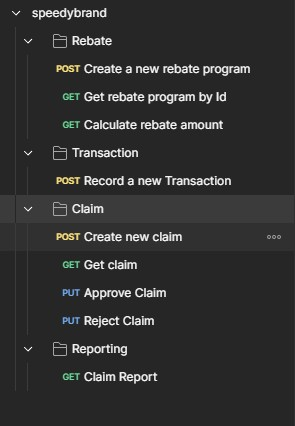

# Rebate Service
## Introduction
This is a basic rebate management system that can handle rebate program data, calculates rebates, and provides endpoints for basic reporting.

## Tl;dr
1. Refer to [How to set up and run](#How-to-set-up-and-run) to set up application locally
2. Then refer to [Using postman collection](#Using-postman-collection) to use APIs in Postman

## Features
| Feature               | Endpoint                                           | Description                                                                                                                                                                                                          |
|-----------------------|----------------------------------------------------|----------------------------------------------------------------------------------------------------------------------------------------------------------------------------------------------------------------------|
| Create Rebate Program | POST {{host}}/rebate/create                        | An endpoint to create a new rebate program with all relevant details                                                                                                                                                 |
| Get Rebate Program    | GET {{host}}/rebate/\<rebate_program_id\>          | An endpoint to get rebate program by id with all relevant details                                                                                                                                                    |
| Record Transaction    | POST {{host}}/transaction/record                   | An endpoint to record a new transaction that could be eligible for a rebate                                                                                                                                          |
| Calculate Rebate      | GET {{host}}/rebate/calculate/\<transaction_id\>   | An endpoint to calculate the rebate amount for a given transaction based on the associated rebate program                                                                                                            |
| Create Claim          | POST {{host}}/claim/create?tid=\<transaction_id\>  | An endpoint to create a claim for a transaction, marking the status as "pending"                                                                                                                                     |
| Get Claim details     | GET {{host}}/claim/\<claimId\>                     | An endpoint to fetch a rebate claim by claim id                                                                                                                                                                      |
| Approve a claim       | PUT {{host}}/claim/\<claimId\>/approve             | An endpoint to approve a claim, marking the status as "approved".<br/>This will only pass if claim is in pending state.                                                                                              |
| Reject a claim        | PUT {{host}}/claim/\<claimId\>/reject              | An endpoint to reject a claim, marking the status as "rejected".<br/>This will only pass if claim is in pending state.                                                                                               |
| Reporting             | GET {{host}}/report/claims?from=\<from\>&to=\<to\> | An endpoint that returns a summary of total rebate claims and the amount approved for a given time period<br/>Both dates should be url-encoded in `ISO_LOCAL_DATE_TIME` format (Ex. `2024-01-13T00:04:01.546+00:00`) |

| **Other Features**          | Note                                                                                                                                                                                                     |
|-----------------------------|----------------------------------------------------------------------------------------------------------------------------------------------------------------------------------------------------------|
| Caching                     | Spring caching annotations has been used to enable caching when fetching rebate program or transactions from repository.<br/>Claims data has not been cached as it is suppose to change                  |
| Configurable                | The application is somewhat configurable. I am using Spring `@Value` annotations to load application configuration from [application.properties](src/main/resources/application.properties)              |
| Docker Compose              | You can run application in a local docker env by running `make run-all` in project directory. Refer to [Option 2](#option-2-run-application-in-docker-with-mongodb-server-running-in-container) for more |
| Error Handling & Validation | Proper input validation and error handling has been implemented.                                                                                                                                         |
| Logging                     | Proper logging has been implemented for debugging                                                                                                                                                        |
| Class diagram               | To learn about module and java classes refer to [Class Diagram](#Class-Diagram) section                                                                                                                  |

## Version information
```text
    openjdk version "17.0.1" 2021-10-19
    OpenJDK Runtime Environment (build 17.0.1+12-39)
    OpenJDK 64-Bit Server VM (build 17.0.1+12-39, mixed mode, sharing)
```


## How to set up and run
There are few option you can choose from to run this application. The application uses MongoDb as its underlying database engine. This engine could be running locally, as a container or in cloud.
Follow steps as per your requirements.

Clone the repo
```sh
   git clone git@github.com:rahul38888/rebate-service.git
```
Create a clean room
```sh
    make clean-room
```

### Option 1. Run with local MongoDb Server
1. Set database connection string in environments
```sh
    export CONNECTION_STRING=mongodb://localhost:27017/
```
2. Install dependencies and build jar
```sh
    mvn clean install -DskipTests
```
3. Start application
```sh
  java -jar target/rebate-service-1.0-SNAPSHOT.jar
```

### Option 2. Run application in Docker with MongoDb Server running in container
1. Make sure your docker engine is running before moving forward
2. Build container and run docker service
```sh
    make run-all
```

### Option 3. Run application with cloud mongo server
I am using Atlas's free shared MongoDb Cluster for this part. AWS provides DocumentDb as their own version of MongoDb, which can be used by just replacing connection string in later steps.

1. Make sure that proper Network access rules has been set so that the local instance of your application can connect to the cluster. 
With free account you can whitelist your current IP address or Allow Access From Everywhere (Which is not advised).
2. Set database connection string in environments
```sh
    export CONNECTION_STRING=mongodb+srv://<username>:<password>@<cluster_name>.zzzzz.mongodb.net/?retryWrites=true&w=majority&appName=<appName>
```
You need not build this connection string. Just go to Connect -> Java on Atlas cluster home page.
3. Install dependencies and build jar
```sh
    mvn clean install -DskipTests
```
4. Start application
```sh
  java -jar target/rebate-service-1.0-SNAPSHOT.jar
```

## Class Diagram
[](documentation/class_diagram.svg)

## Using postman collection
The postman collection and environment export files are present in [here](documentation/postman).
The collection is exported using v2.1 format and can be imported into postman. If you are using Insomnia or some other API platform application you might require to do extra steps to import it.

### Postman API tree structure:



Environment is named **local** and just contain `host` as the only required variable. If you want to create your own environment make suer to initialize this.

### API workflow


**Note**: You need not copy ids between API calls. I have used Postman's Post-result feature to automate ID capturing on each create/report request as env variables.
These env variable will be used in next API.

When using Claim Reporting API make sure that you url-encoded dates in `ISO_LOCAL_DATE_TIME` format (Ex. `2024-01-13T00:04:01.546+00:00`)